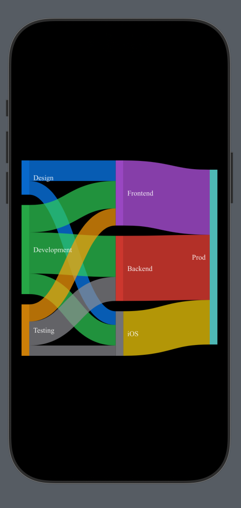

#### About

Sankey diagrams in SwiftUI, powered by [D3](https://github.com/d3/d3-sankey).

#### Quickstart

Make beautiful charts like this:


With code as simple as this:

```swift
import Sankey
import SwiftUI

struct QuickStartView: View {
    let data = SankeyData(
        nodes: [
            SankeyNode("A", color: .blue),
            SankeyNode("B", color: .purple),
            SankeyNode("X", color: .red),
            SankeyNode("Y", color: .yellow),
            SankeyNode("Z", color: .green),
        ],
        links: [
            SankeyLink(5, from: "A", to: "X"),
            SankeyLink(7, from: "A", to: "Y"),
            SankeyLink(6, from: "A", to: "Z"),
            SankeyLink(2, from: "B", to: "X"),
            SankeyLink(9, from: "B", to: "Y"),
            SankeyLink(4, from: "B", to: "Z"),
        ]
    )
    
    var body: some View {
        SankeyDiagram(data)
            .nodeOpacity(0.9)
            .linkColorMode(.sourceTarget)
            .padding(10)
            .frame(height: 350)
    }
}

#Preview {
    QuickstartView()
}
```

#### Installation

Add `Sankey` to your project using Swift Package Manager:

1. In Xcode, select your project in the Project Navigator
2. Navigate to Package Dependencies
3. Click the + button
4. Enter the repository URL: `https://github.com/maxhumber/Sankey`

#### Usage

Customize `SankeyDiagram` with simple modifiers:

```swift
struct UsageExampleView: View {
    let data = SankeyData(
        nodes: [
            SankeyNode("Design", color: .blue),
            SankeyNode("Development", color: .green),
            SankeyNode("Testing", color: .orange),
            SankeyNode("Frontend", color: .purple),
            SankeyNode("Backend", color: .red),
            SankeyNode("Mobile", label: "iOS"),
            SankeyNode("Production", label: "Prod", color: .mint)
        ],
        links: [
            SankeyLink(30, from: "Design", to: "Frontend", color: .blue),
            SankeyLink(20, from: "Design", to: "Mobile", color: .blue),
            SankeyLink(40, from: "Development", to: "Frontend", color: .green),
            SankeyLink(60, from: "Development", to: "Backend", color: .green),
            SankeyLink(30, from: "Development", to: "Mobile", color: .green),
            SankeyLink(25, from: "Testing", to: "Frontend", color: .orange),
            SankeyLink(35, from: "Testing", to: "Backend"),
            SankeyLink(15, from: "Testing", to: "Mobile"),
            SankeyLink(95, from: "Frontend", to: "Production", color: .purple),
            SankeyLink(95, from: "Backend", to: "Production", color: .red),
            SankeyLink(65, from: "Mobile", to: "Production", color: .yellow)
        ]
    )
    
    var body: some View {
        SankeyDiagram(data)
            // Node modifiers
            .nodeAlignment(.justify)
            .nodeWidth(15)
            .nodePadding(20)
            .nodeDefaultColor(.gray)
            .nodeOpacity(0.8)
            // Link modifiers
            .linkDefaultColor(.gray)
            .linkOpacity(0.7)
            .linkColorMode(nil)
            // Label modifiers
            .labelPadding(8)
            .labelColor(.primary)
            .labelOpacity(0.9)
            .labelFontSize(14)
            .labelFontFamily("Times")
            // Normal view modifiers
            .padding(10)
            .frame(height: 400)
    }
}

#Preview {
    UsageExampleView()
        .preferredColorScheme(.dark)
}
```



Find more examples in the [Examples App](Examples/Examples/ExamplesApp.swift).

#### ⚠️ Version Compatibility

> **Note**: Version `2.0`+ uses D3 for rendering. For projects requiring the previous Google Charts implementation, use version `1.0`/`1.0.1` via SPM.

Key differences in `2.0`+:
- Streamlined API
- Improved color handling
- Built-in dark mode
- Offline rendering support

For legacy implementation details, see the [v1.0.1 documentation](https://github.com/maxhumber/Sankey/blob/1.0.1/README.md#quickstart).
